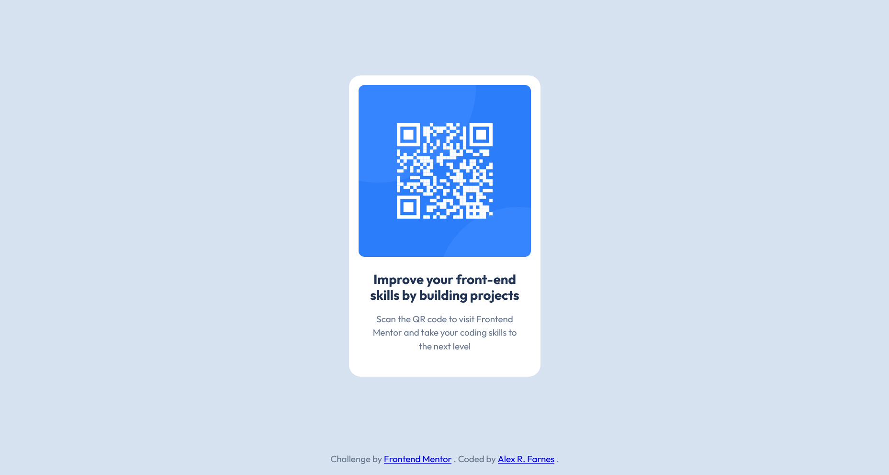
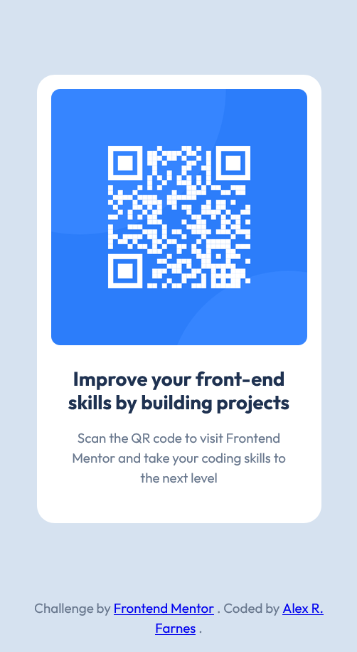

# Frontend Mentor - QR code component solution

This is a solution to the [QR code component challenge on Frontend Mentor](https://www.frontendmentor.io/challenges/qr-code-component-iux_sIO_H). Frontend Mentor challenges help you improve your coding skills by building realistic projects.

## Table of contents

- [Frontend Mentor - QR code component solution](#frontend-mentor---qr-code-component-solution)
  - [Table of contents](#table-of-contents)
  - [Overview](#overview)
    - [Screenshot](#screenshot)
    - [Links](#links)
  - [My process](#my-process)
    - [Built with](#built-with)
    - [What I learned](#what-i-learned)
    - [Continued development](#continued-development)
  - [Author](#author)

## Overview

### Screenshot




### Links

- Solution URL: [https://github.com/AlexRFarnes/qr-code-component.git](https://github.com/AlexRFarnes/qr-code-component.git)
- Live Site URL: [https://alexrfarnes.github.io/qr-code-component/](https://alexrfarnes.github.io/qr-code-component/)

## My process

### Built with

- Semantic HTML5 markup
- CSS custom properties
- CSS Grid

### What I learned

I feel like I've finally grasped the article element's semantics and understood when to use it. Regarding CSS, putting into practice the use of Grid to center the card and placing the footer at the bottom. Additionaly, the process of structuring the CSS file was an interesting thought process.

```css
body {
  min-block-size: 100vh;
  display: grid;
  grid-template-rows: 1fr auto;
  place-items: center;
}
```

### Continued development

Since this was a simple project, structuring the CSS was not too complicated, so I want to keep practicing how to structe CSS files for more complex projects, including layers, and, also dive into layouts with Flexbox, Grid, media queries and container queries.

## Author

- Website - [Alex R. Farnes](https://www.alexrfarnes.dev/) (🚧 site in construction)
- Frontend Mentor - [@AlexRFarnes](https://www.frontendmentor.io/profile/AlexRFarnes)
- LinkedIn - [@alexrfarnes](https://www.linkedin.com/in/alexrfarnes)
